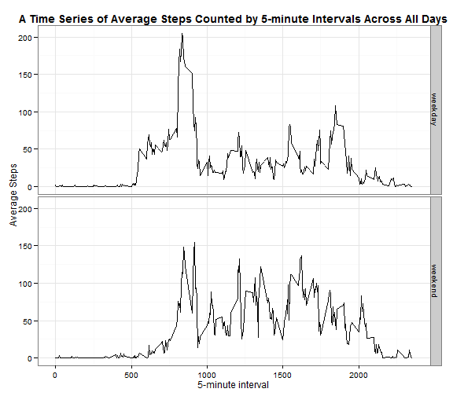

## Reproducible Research: Peer Assessment 1

### Setting up the working directory:

```r
setwd("E:\\Open University\\Reproducible_Research@Johns_Hopkins\\Projects\\RepData_PeerAssessment1")
Sys.setlocale(category = "LC_ALL", locale = "UK")
```

```
## [1] "LC_COLLATE=English_United Kingdom.1252;LC_CTYPE=English_United Kingdom.1252;LC_MONETARY=English_United Kingdom.1252;LC_NUMERIC=C;LC_TIME=English_United Kingdom.1252"
```

### Loading and attaching required package(s)

```r
library(data.table)
library(ggplot2)
```

### Loading and preprocessing the data

```r
activity <- fread("activity.csv", na.strings="NA")
activity <- transform(activity, date=as.Date(date, "%Y-%m-%d"))
```


### What is mean total number of steps taken per day?

```r
dailysteps <- activity[,sum(steps, na.rm=TRUE),by=date]
setnames(dailysteps, names(dailysteps), c("date", "steps"))

median.steps <- round(median(dailysteps$steps, na.rm=TRUE), 0)
mean.steps <- round(mean(dailysteps$steps, na.rm=TRUE), 0)

g <- ggplot(dailysteps, aes(x=steps)) +
    geom_histogram(binwidth=2000, colour="black", fill="red") +
    geom_vline(xintercept=c(median.steps, mean.steps), 
               color=c("green", "blue"), linetype="dashed", size=1) +
    annotate("text", x=c(mean.steps - 4000), y=c(12.5, 13.5),
             label=c(paste("median=", median.steps), paste("mean=", mean.steps)),
             family="serif", fontface="italic", color=c("green", "blue"), size = 5, alpha = .6) +
    labs(x="Total Number of Steps Taken per Day", y="Frequency(days)") +
    ggtitle("An Overview of Total Number of Steps Taken per Day") +
    theme_bw() +
    theme(plot.title = element_text(lineheight=.8, face="bold"))           
g
```

 

- The **mean total number of steps** taken per day is *9354*.
- The **median total number of steps** taken per day is *1.0395 &times; 10<sup>4</sup>*. 

### What is the average daily activity pattern?

```r
interval.steps <- activity[, round(mean(steps, na.rm=TRUE), 0), by=interval]
setnames(interval.steps, names(interval.steps), c("interval", "steps"))
max.index <- which.max(interval.steps$steps)

g <- ggplot(interval.steps, aes(x=interval, y=steps)) +
    geom_line(size=.6) +
    geom_vline(aes(xintercept=interval[max.index]), 
               color=c("blue"), linetype="dashed", size=1) +
    annotate("text", x=interval.steps$interval[max.index] + 250, 
             y=interval.steps$steps[max.index],
             label=paste("max=", interval.steps$steps[max.index]),
             family="serif", fontface="italic", color=c("blue"), size = 5, alpha = 1) +
    scale_x_continuous(breaks=c(0, 500, interval.steps$interval[max.index], 1000, 1500, 2000),
                       labels=c(0, 500, interval.steps$interval[max.index], 1000, 1500, 2000)) +
    labs(x="5-minute interval", y="Average Steps") +
    ggtitle("A Time Series of Average Steps Counted by 5-minute Intervals Across All Days") +
    theme_bw() +
    theme(plot.title = element_text(lineheight=.8, face="bold"))
g
```

 

- The interval **835** on average across all the days in the dataset contains the maximum number of steps which is *206*.

### Imputing missing values

```r
missing.count <- sum(is.na(activity$steps))
missing.pct <- paste0(round(100*mean(is.na(activity$steps)), 2), "%")
```
- There are **2304**(*13.11%*) missing values in the dataset.

Filling in all of the missing values in the dataset with the median values for that 5-minute interval.

```r
interval.steps <- activity[, round(median(steps, na.rm=TRUE), 0), by=interval]
interval.steps <- transform(interval.steps, interval=as.character(interval))
setnames(interval.steps, names(interval.steps), c("interval", "steps"))
setkey(interval.steps, interval)
activity.filled <- activity
activity.filled$steps[is.na(activity$steps)] <- 
    interval.steps[as.character(activity$interval[is.na(activity$steps)])]$steps
```


```r
dailysteps.filled <- activity.filled[,sum(steps),by=date]
setnames(dailysteps.filled, names(dailysteps.filled), c("date", "steps"))

median.steps.filled <- round(median(dailysteps.filled$steps, na.rm=TRUE), 0)
mean.steps.filled <- round(mean(dailysteps.filled$steps, na.rm=TRUE), 0)

g <- ggplot(dailysteps.filled, aes(x=steps)) +
    geom_histogram(binwidth=2000, colour="black", fill="red") +
    geom_vline(xintercept=c(median.steps.filled, mean.steps.filled), 
               color=c("green", "blue"), linetype="dashed", size=1) +
    annotate("text", x=c(median.steps.filled - 4000), y=c(12.5,13.5),
             label=c(paste("median=", median.steps.filled), paste("mean=", mean.steps.filled)),
             family="serif", fontface="italic", color=c("green", "blue"), size = 5, alpha = .6) +
    labs(x="Total Number of Steps Taken per Day", y="Frequency(days)") +
    ggtitle("An Overview of Total Number of Steps Taken per Day\n (missing data filled in with the median value for that 5-minute interval)") +
    theme_bw() +
    theme(plot.title = element_text(lineheight=.8, face="bold"))           
g
```

 

- The **mean total number of steps** taken per day of the new data set is *9504*.
- The **median total number of steps** taken per day of the new data set is *1.0395 &times; 10<sup>4</sup>*.
- It can be noticed that the **mean steps has changed** while the **median steps has not**.
- Since the percentage of missing data is only *13.11%*, **the impact** of imputing missing data on the estimates of the total daily number of steps **is not significant** as shown in our figures.


### Are there differences in activity patterns between weekdays and weekends?


```r
activity.filled$weekdays <- factor(weekdays(activity.filled$date), levels=c("Monday", "Tuesday", "Wednesday", "Thursday", "Friday", "Saturday", "Sunday"))
levels(activity.filled$weekdays) <- c("weekday", "weekday", "weekday", "weekday", "weekday", "weekend", "weekend")

interval.steps <- activity.filled[, round(mean(steps, na.rm=TRUE), 0), by="weekdays,interval"]
setnames(interval.steps, names(interval.steps), c("weekdays", "interval", "steps"))

g <- ggplot(interval.steps, aes(x=interval, y=steps)) +
    facet_grid(weekdays ~ .) +
    geom_line(size=.6) +
    labs(x="5-minute interval", y="Average Steps") +
    ggtitle("A Time Series of Average Steps Counted by 5-minute Intervals Across All Days") +
    theme_bw() +
    theme(plot.title = element_text(lineheight=.8, face="bold"))
g
```

 
